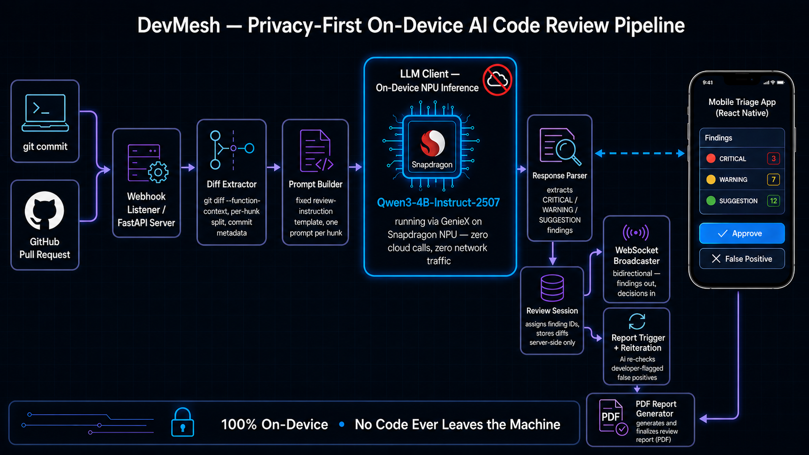
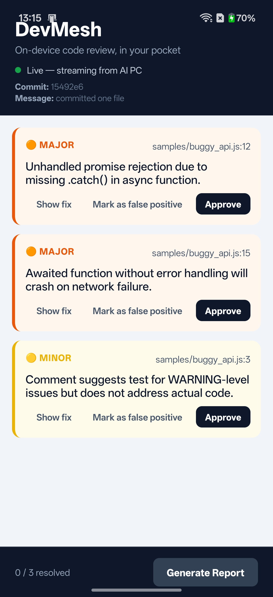
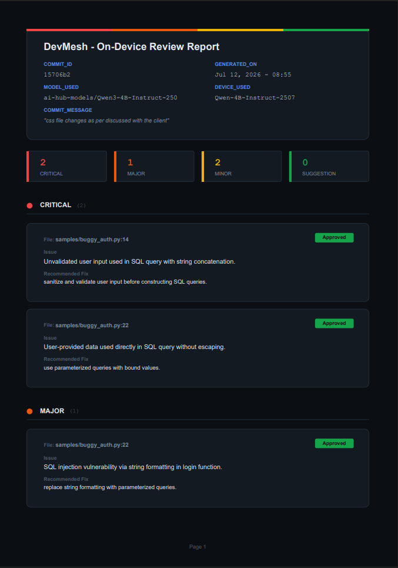

# DevMesh

**An AI-powered code reviewer that runs entirely on-device using Snapdragon
NPUs - keeping proprietary source code private while delivering instant,
offline code reviews.**


Built for the **Snapdragon® Multiverse Hackathon** (Bangalore) - Top 50
Teams (India level), Phase 2 build.

---

## In 30 seconds

- ✅ Runs entirely on Snapdragon NPUs - no cloud API, no CPU fallback needed
- ✅ Reviews Git commits and GitHub PRs automatically
- ✅ Never uploads a single line of source code
- ✅ Streams findings to a mobile app in real time for triage
- ✅ Lets the developer push back - the AI reconsiders any finding flagged
  as a false positive, given the developer's reasoning
- ✅ Generates a fully offline PDF report

`git commit` (or a GitHub PR) triggers diff extraction → a local LLM running
**entirely on a Snapdragon NPU** analyzes the diff → findings stream live to
a mobile triage app → the developer approves each finding or flags it as a
false positive → the AI reconsiders flagged findings given the developer's
reasoning → a final PDF report is generated on-device.

**No internet dependency for review. No API keys. No code ever leaves the
machine.** Confirmed end-to-end on Snapdragon X Elite hardware, running
fully on-NPU via Qualcomm AI Hub's GenieX runtime - not a CPU fallback, not
a mock.

---

## Table of contents

- [Why DevMesh exists](#why-devmesh-exists)
- [Team](#team)
- [How it works](#how-it-works)
- [Results](#results)
- [Tech stack](#tech-stack)
- [Repository structure](#repository-structure)
- [Setup - from scratch](#setup--from-scratch)
- [Run & usage instructions](#run--usage-instructions)
- [Screenshots & demo](#screenshots--demo)
- [Verifying the setup (tests)](#verifying-the-setup-tests)
- [Known issues](#known-issues)
- [Notes](#notes)
- [Future work](#future-work)
- [References](#references)
- [License](#license)

---

## Why DevMesh exists

AI code review tools (GitHub Copilot, CodeRabbit, Cursor, etc.) are great,
but every one of them sends your source code to a cloud API. For a huge
class of developers - fintech, healthtech, defense, government, or just
companies with a strict data-residency policy - that's a non-starter. India
alone has an estimated 5.8M developers, and a meaningful slice of them work
somewhere that simply will not permit proprietary code to leave the
building, let alone the country.

DevMesh answers a simple question: **can you get a genuinely useful AI code
reviewer without any of the code ever touching the network?** The answer is
yes, if the model runs on the same machine that owns the code - and modern
Snapdragon NPUs are fast enough to make that practical rather than
theoretical. DevMesh runs a 4B-parameter instruction-tuned model
(Qwen3-4B-Instruct-2507) entirely on-NPU via Qualcomm AI Hub / GenieX,
reviews your diff the moment you commit, and lets you triage the findings
from your phone - with zero code ever transmitted anywhere.

## Team

| Name | Role | Email |
|---|---|---|
| Hardik Parmar | Team Lead - LLM integration, prompt engineering, response parsing, WebSocket server, backend orchestration, structured logging | hj.parmar1@tcs.com, hi@hardikjp7.com |
| Vatsal Bhavesh | React Native mobile app, WebSocket client, fpdf2 PDF report generator, false-positive UX | vb.mandaliya@tcs.com |
| Dhruv | Git hook, GitHub webhook listener, FastAPI server | ds.bailkur@tcs.com |

## How it works



<!--
SNAPDRAGON AI PC
  git commit  /  GitHub PR
       │
  diff_extractor.py    - git diff --function-context, split into per-hunk chunks, capture commit metadata
       │
  prompt_builder.py    - fixed-format review-instruction template, one prompt per hunk
       │
  llm_client.py         - review_hunk(prompt) -> LLMResult
       │   backend "qnn" (default): geniex infer <model> -c npu -i <promptfile> --think=false   [on-NPU, venue/production]
       │   backend "ollama": local Ollama HTTP call                                              [dev/testing/demo fallback]
       │   DEVMESH_MOCK_LLM=1: canned response, bypasses both                                     [pipeline-only testing]
       │
  response_parser.py    - tolerant "[SEVERITY] file:line - description. Fix: ..." parser
       │
  review_session.py     - assigns each finding a stable id, retains its source diff server-side only
       │                                          │
  ws_broadcaster.py                         report_trigger.py
  (bidirectional WebSocket:                  (on "generate_report": runs reiteration.py
   findings out, decisions in)                for any undecided false-positives, then
       │                                       calls report_generator.py)
  Mobile App (React Native)                          │
  approve / flag false-positive+reason /       pdf_report.py (fpdf2) - PDF + plain-text
  generate report                              debug copy, written locally
-->

1. **Trigger.** A `git commit` fires the `post-commit` hook, or a GitHub PR
   webhook lands on the FastAPI listener. Both routes funnel into the
   *same already-running* backend process - never two independent
   pipeline instances (see [Known Issues / architecture notes](#notes)
   for why that matters).
2. **Diff extraction.** `git diff --function-context` gives each hunk full
   enclosing-function context, not just the default 3 lines.
3. **Review.** Each hunk is sent to the LLM with a fixed-format prompt.
   On Snapdragon X Elite hardware this runs via `geniex infer` on the NPU;
   Ollama is the CPU fallback for development machines without the
   Snapdragon backend.
4. **Parsing.** The model's raw text is parsed into structured
   `CRITICAL` / `MAJOR` / `MINOR `/ `SUGGESTION` findings.
5. **Broadcast.** Findings stream to the mobile app over a WebSocket, grouped
   by commit.
6. **Triage.** On the phone, each finding is either **Approved** or marked
   **False Positive** (a real justification is required - a one-word
   dismissal is rejected before it ever reaches the model).
7. **Reiteration.** When the developer asks to generate the report, every
   false-positive-flagged finding is re-sent to the LLM along with the
   original diff and the developer's comment. The model replies
   `MAINTAINED`, `WITHDRAWN`, or `PARTIALLY_VALID` with a short
   explanation - so a developer's dismissal doesn't just silently make an
   issue vanish.
8. **Report.** A designed PDF (plus a plain-text debug copy) is written
   locally, covering every approved finding and every reiterated false
   positive.

## Results

Measured on Snapdragon X Elite CRD hardware, on-NPU, via GenieX:

| Metric | Value |
|---|---|
| Execution | 100% offline - zero network calls during review |
| Model | Qwen3-4B-Instruct-2507 (non-thinking variant) |
| Prefill throughput | ~1,301 tok/s |
| Decode throughput | ~23.1 tok/s |
| Observed per-hunk latency | ~11.8s – 34.4s (validated on Snapdragon X Elite hardware) |
| Context window | 4,096 tokens |
| Network dependency | None - code never leaves the device |

These numbers come from real per-hunk benchmark runs on venue hardware
(`backend/benchmark.py`), not simulated or CPU-only figures - see
[Verifying the setup](#verifying-the-setup-tests) to reproduce them.

## Tech stack

| Component | Technology |
|---|---|
| LLM model | **Qwen3-4B-Instruct-2507** - selected after direct benchmarking on Snapdragon X Elite: native NPU/QAIRT runtime, 4096-token context, 1,301 tok/s prefill, 23.1 tok/s decode |
| LLM runtime (production) | `geniex infer` - Qualcomm AI Hub's GenieX CLI, one-shot per hunk, on-NPU |
| LLM runtime (dev/fallback) | [Ollama](https://ollama.com) (`qwen3:4b-instruct`), CPU-only |
| Backend | Python 3.10+, FastAPI, `websockets` |
| Git/PR trigger | Shell hook (`hooks/post-commit`) → FastAPI webhook listener |
| Mobile app | React Native (Expo) - display/triage only, zero on-device inference |
| Report generation | [fpdf2](https://github.com/py-pdf/fpdf2) - pure-Python PDF rendering (no native deps, ARM64-safe) |
| Structured logging | Custom `devlog.py` - console + persistent commit-tagged log file |

## Repository structure

```
devmesh/
├── backend/     Python - review pipeline, WebSocket server, webhook listener, PDF report generation
├── mobile/      React Native (Expo) - triage app
├── hooks/       post-commit git hook
├── samples/     demo buggy files used for live-review testing
├── setup.sh     one-command install + hook install + start everything
├── README.md
└── LICENSE      MIT
```

<details>
<summary><strong>Full backend/ file layout</strong> (click to expand)</summary>

```
backend/
├── run_review.py         CLI entrypoint - reviews one commit per invocation
├── webhook_server.py     FastAPI listener - real GitHub PR + local-commit trigger
├── diff_extractor.py     git diff, hunk splitting, commit metadata
├── prompt_builder.py     fixed review-prompt template
├── llm_client.py         review_hunk() - geniex / ollama / mock backend dispatch
├── response_parser.py    tolerant finding parser (see Known Issues)
├── review_session.py     in-memory session: finding ids, decisions, commit info
├── reiteration.py        false-positive re-check prompt + parser
├── report_trigger.py     orchestrates reiteration pass + report generation
├── report_generator.py   writes PDF (via pdf_report.py) + plain-text debug copy
├── pdf_report.py         fpdf2 PDF layout
├── ws_broadcaster.py     bidirectional WebSocket server
├── devlog.py             structured logging (console + logs/devmesh.log)
├── benchmark.py          per-hunk latency benchmarking harness
└── requirements.txt
```

</details>

## Setup - from scratch

These steps take you from a clean machine to a running system. Two backend
paths are supported - pick based on what hardware you have:

- **Snapdragon X Elite (or similar ARM64 NPU device)** → the real,
  on-NPU path via Qualcomm AI Hub / GenieX. This is what the hackathon
  submission runs on.
- **Any other machine (Windows/Mac/Linux, x86 or otherwise)** → the Ollama
  CPU fallback. Functionally identical pipeline, just slower and not
  running on an NPU.

### 1. Prerequisites

| Tool | Why | Check |
|---|---|---|
| Python 3.10+ | Backend pipeline, webhook listener | `python3 --version` |
| Node.js (LTS) + npm | Mobile app (Expo/React Native) | `node --version` |
| Git | Version control | `git --version` |
| Expo Go (App Store / Play Store) | Run the mobile app on your phone | - |
| **Either:** Ollama (dev/fallback) | Local CPU LLM | `ollama --version` |
| **Or:** Qualcomm AI Hub / GenieX SDK (venue path) | On-NPU LLM inference | `geniex --version` |

### 2. Clone the repository

```bash
git clone <this-repo-url> devmesh
cd devmesh
```

### 3. Install backend dependencies

```bash
cd backend
pip install -r requirements.txt
# On Linux with an externally-managed Python environment:
pip install -r requirements.txt --break-system-packages
# or use a virtualenv:
python3 -m venv .venv && source .venv/bin/activate && pip install -r requirements.txt
cd ..
```

### 4. Install mobile app dependencies

```bash
cd mobile
npm install
cd ..
```

### 5A. Set up the LLM backend - Ollama path (any machine)

```bash
# Install from https://ollama.com, then:
ollama pull qwen3:4b-instruct
ollama serve   # leave running in its own terminal
```

DevMesh defaults `DEVMESH_BACKEND` to `qnn` (the NPU path). To use Ollama
instead, set the env var when running the backend:

```bash
export DEVMESH_BACKEND=ollama   # Windows PowerShell: $env:DEVMESH_BACKEND="ollama"
```

### 5B. Set up the LLM backend - GenieX / NPU path (Snapdragon devices)

1. Install the Qualcomm AI Hub / QAIRT SDK and confirm `geniex` is on your
   `PATH` (`geniex --version`).
2. Download or compile the **Qwen3-4B-Instruct-2507** model for your device
   via Qualcomm AI Hub.
3. No extra env var is needed - `qnn` is the default backend. Optional
   overrides:

   | Variable | Purpose | Default |
   |---|---|---|
   | `DEVMESH_GENIE_MODEL` | Model identifier passed to `geniex infer` | `ai-hub-models/Qwen3-4B-Instruct-2507` |
   | `DEVMESH_GENIE_COMPUTE` | Compute target | `npu` |
   | `DEVMESH_GENIE_THINK` | Enable/disable the model's thinking mode | `false` |
   | `DEVMESH_GENIE_PROMPT_FILE` | Path to the fixed prompt file `geniex` reads from | `backend/devmesh_geniex_prompt.txt` |

### 6. Install the git hook and start the backend

From the repository root:

```bash
chmod +x setup.sh
./setup.sh
```

`setup.sh` will:

1. Install backend Python dependencies (non-fatal on failure - installs the hook regardless).
2. Install `hooks/post-commit` into `.git/hooks/post-commit`.
3. Start the FastAPI webhook listener in the background on port `8000` (this also starts the WebSocket server on port `8765`).
4. Start the Expo mobile development server in the background on a fixed port (`5678`), logging its QR code to `logs/devmesh_expo.log`.

Safe to re-run anytime—it won't double-start the webhook listener.

> **Note:** If the Expo QR code does not appear after running `setup.sh`, start the Expo development server manually:
>
> ```bash
> cd mobile
> npx expo start
> ```
>
> Once the Expo CLI starts, the QR code should be displayed. If your physical device does not automatically appear as connected, use the **Down Arrow (↓)** key in the Expo CLI to select your device and approve the connection. After approval, you can scan the QR code (if needed) and continue development normally.

> If you are not inside a Git repository yet, run `git init` first. The script will display a warning and skip the hook installation otherwise.


### 7. Point the mobile app at your machine

Edit `mobile/App.js` and set `SERVER_IP` to your laptop's LAN IP (phone and
laptop must be on the same Wi-Fi):

```js
const SERVER_IP = "x.x.x.x"; // your laptop's LAN IP, not the phone's
```

Find your IP with `ipconfig` (Windows) or `ifconfig` / `ip addr`
(Mac/Linux).

---

## Run & usage instructions

### Scan the QR code

```bash
cat logs/devmesh_expo.log
```

Scan it with Expo Go on your phone. The app shows a live "Waiting for AI
PC" status with a retry counter until a real review runs - there's also a
**Show Demo Data** button for offline UI demoing, clearly banner-labeled
as sample data.

### Trigger a review - three ways

**A. Automatic, via a real commit:**
```bash
git add samples/buggy_auth.py
git commit -m "test commit"
```
The hook fires in the background; `git commit` returns immediately.

**B. Simulate a GitHub PR:**
```bash
curl -X POST http://localhost:8000/webhook \
  -H "X-GitHub-Event: pull_request" \
  -H "Content-Type: application/json" \
  -d '{"action": "opened", "pull_request": {"number": 1}}'
```

**C. Manual CLI, for debugging one component at a time:**
```bash
cd backend
python run_review.py              # reviews the last commit
python run_review.py --staged     # reviews staged changes instead
python run_review.py --repo /path/to/other/repo
```

All three converge on the same output: findings pushed to any connected
mobile client, and (once the developer resolves every finding on mobile and
taps **Generate Report**) a PDF written to `backend/devmesh_report_<short_commit_hash>.pdf`.

### On mobile

1. Each finding shows severity, file/line, description, and a suggested
   fix.
2. Tap **Approve** or **Mark False Positive** (the latter requires typing a
   real reason).
3. Tap **Generate Report** once every finding is resolved. Any false
   positives without a verdict yet trigger an AI re-check first
   ("Verifying false positives…"), then the report generates automatically.
4. A native alert confirms the report's file path when it's ready, and
   resets the screen for the next commit.

### Environment variables (all optional)

| Variable | Purpose | Default |
|---|---|---|
| `DEVMESH_BACKEND` | `qnn` (on-NPU, Snapdragon hardware) or `ollama` (CPU dev/fallback) | `qnn` |
| `DEVMESH_MODEL` | Ollama model tag (only used when `DEVMESH_BACKEND=ollama`) | `qwen3:4b-instruct` |
| `DEVMESH_GENIE_MODEL` | GenieX model identifier | `ai-hub-models/Qwen3-4B-Instruct-2507` |
| `DEVMESH_GENIE_COMPUTE` | GenieX compute target | `npu` |
| `DEVMESH_GENIE_THINK` | GenieX thinking-mode toggle | `false` |
| `DEVMESH_MOCK_LLM` | `1` to bypass the LLM entirely with a canned response (fast pipeline testing) | `0` |
| `DEVMESH_TIMEOUT` | LLM call timeout, seconds | `420` |
| `DEVMESH_LOG_LEVEL` | `DEBUG` / `INFO` / `WARNING` / `ERROR` | `INFO` |
| `DEVMESH_LOG_DIR` | Where `devmesh.log` is written | `./logs` |
| `GITHUB_TOKEN` | Optional, avoids GitHub's 60 req/hr unauthenticated rate limit for real PR diff fetches | unset |

---
## 📸 Screenshots

### Mobile triage app

<p align="center">
  
</p>

The developer reviews findings, approves valid issues, or marks false positives and then click on generate report to generate PDF report.

---

### Live review

<p align="center">
  
</p>

A commit automatically triggers the on-device review pipeline.

---

### Generated PDF report

<p align="center">
  
</p>

Offline report summarizing approved findings and AI re-evaluation results.

---

## 🎥 Demo

Watch the complete workflow here:

[Watch live demo](https://drive.google.com/file/d/1WKTO-hYO7K9tGjn8HjS0FEZF99qaIVsA/view?usp=drive_link)

---

## Verifying the setup (tests)

These checks confirm each layer works independently, cheapest first:

```bash
cd backend

# 1. Parser sanity check (no LLM needed)
python response_parser.py
# Expect: prints several Finding(...) objects

# 2. Prompt template sanity check (no LLM needed)
python prompt_builder.py
# Expect: prints the filled-in prompt + measured token overhead

# 3. Full pipeline without any LLM (fastest end-to-end check)
DEVMESH_MOCK_LLM=1 python run_review.py
# Expect: instant run, canned findings broadcast + report written

# 4. Real LLM connection
python llm_client.py
# Expect: a latency number and raw model output resembling
# "[CRITICAL] file.py:1 - ... Fix: ..."

# 5. Webhook listener health
curl http://localhost:8000/health
# Expect: {"status":"ok","service":"devmesh-webhook-listener"}
```

Latency numbers can be logged systematically with:

```bash
python benchmark.py           # benchmarks the last commit
python benchmark.py --runs 3  # repeats each hunk 3x and averages
```
Writes timestamped CSV + JSON to `backend/benchmark_results/`.

| Symptom | Likely cause |
|---|---|
| `Could not reach Ollama at http://localhost:11434` | `ollama serve` isn't running |
| `geniex executable not found` | GenieX/QAIRT SDK not installed or not on `PATH` |
| `git diff failed` | Not inside a git repo, or no commit exists yet |
| Model output has no `[SEVERITY]` lines | Model ignored the format - consider iterating the prompt wording in `prompt_builder.py` |
| Phone stuck on "Waiting for AI PC" | Check `SERVER_IP` in `mobile/App.js`, confirm same Wi-Fi, check for AP/client isolation |
| Nothing reaches the phone but the report file updates | Two processes are both trying to own the WebSocket port (`8765`) - only ever run one `run_review.py`/webhook-listener process at a time |

---

## Remaining known, deliberate limitations:

- No message backlog/replay - a mobile client that connects *after* a
  review already ran will miss those findings. Connect the mobile client
  before triggering a review.
- Real GitHub PR diffs use GitHub's default 3-line context (not the
  full-function context local commits get) - GitHub's diff API has no
  equivalent option.
- Single review session at a time, in-memory only - a process restart
  loses in-flight decisions. Sufficient for a single demo/review run; would
  need persistence for longer-lived use.

## Notes

- **Why every commit routes through one long-running process:** two
  independent backend processes would each hold their own isolated
  session state, silently causing the mobile app to see stale/null commit
  data depending on which process it happened to be connected to. DevMesh
  enforces a pre-flight port check on its WebSocket port (`8765`) that
  fails loudly rather than allowing a second instance to start.
- **Why the mobile app does no on-device inference:** the privacy story is
  "the machine that owns the code also runs the model" - the phone is
  strictly a triage/display client over a local WebSocket, by design, not
  a limitation.
- **Why fpdf2 instead of WeasyPrint/HTML+CSS:** WeasyPrint pulls in native
  libraries (Cairo/Pango/GDK-PixBuf) that are a real risk on Windows ARM64.
  fpdf2 is pure Python - no native dependencies - which matters for
  "runs everywhere including the Snapdragon ARM64 laptop" as a hard
  requirement, not a preference.
- Structured logs live in `logs/devmesh.log` (Python side, commit-tagged,
  stage-timed - a hang shows up as a `STAGE START` line with no matching
  `STAGE END`) and `logs/devmesh_hooks.log` (bash side).

## Future work

- Multi-developer review sessions (persisted, not single in-memory session)
- Persistent review history across restarts
- VS Code / JetBrains extension for in-editor triage
- Incremental review caching - skip re-reviewing unchanged hunks
- Support for larger NPU-optimized models as Snapdragon NPU headroom grows
- Message backlog/replay for mobile clients that connect mid-review

## References

- [Qualcomm AI Hub](https://aihub.qualcomm.com/) - model benchmarking and
  compilation for Snapdragon NPUs
- [Qualcomm AI Hub documentation](https://app.aihub.qualcomm.com/docs/) -
  model compilation and deployment reference
- [GenieX / QAIRT documentation](https://www.qualcomm.com/developer/software/qualcomm-ai-engine-direct-sdk) -
  Qualcomm AI Engine Direct (QAIRT) SDK, the runtime backing `geniex infer`
- [Qwen3 model family](https://github.com/QwenLM/Qwen3) - the LLM DevMesh
  runs on-device
- [Qwen3 technical report](https://arxiv.org/abs/2505.09388) - model
  architecture and training details
- [Ollama](https://ollama.com) - local LLM runtime used for CPU dev/testing
- [fpdf2](https://github.com/py-pdf/fpdf2) - pure-Python PDF generation
- [Expo](https://expo.dev) / [React Native](https://reactnative.dev) -
  mobile app framework

## License

 Apache-2.0 license - see [LICENSE](LICENSE).
